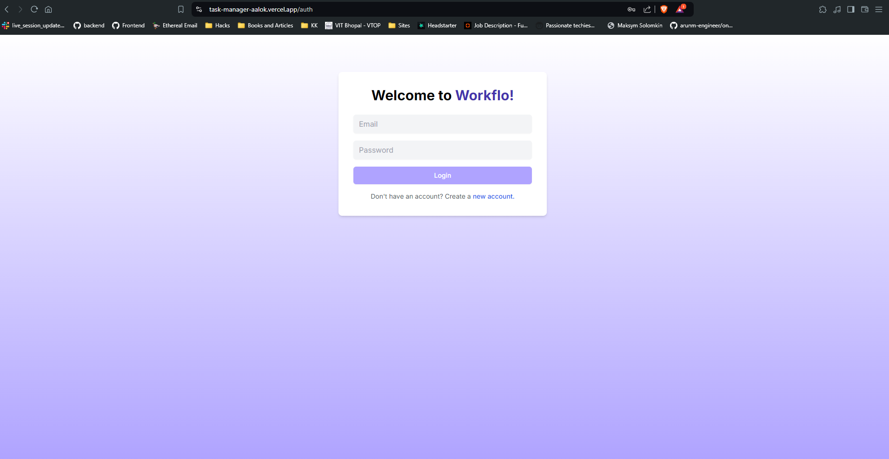
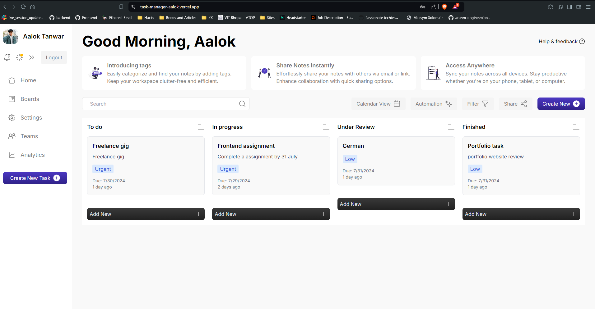
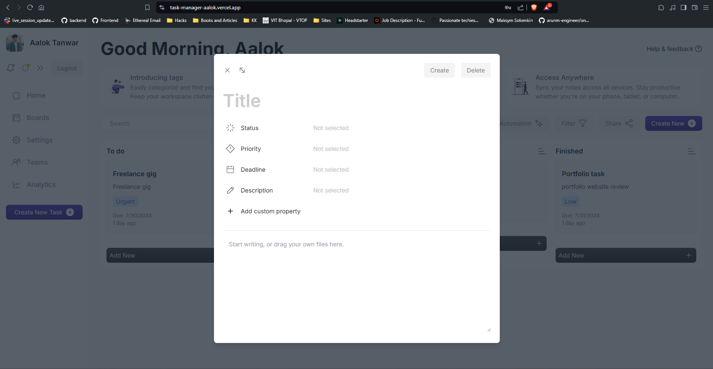

# Task Manager App

## Description

This project is a TypeScript, Next.js, Node.js application that provides trello like task management experience deployed on vercel for frontend and render.com on for backend.





## Prerequisites

Make sure you have the following installed on your local machine:

- [Node.js](https://nodejs.org/) (v14.x or higher)
- [npm](https://www.npmjs.com/) or [yarn](https://yarnpkg.com/) (for package management)

## Getting Started

Follow these steps to set up and run the project locally:

### 1. Setup Backend for project

* ####  Clone the repo and install dependencies

```bash
git clone https://github.com/tanwarAalok/task-manager-backend.git

cd task-manager-backend

npm install
```

* ####  Create .env file in root folder and add the key below
```dotenv
MONGO_URI=
PORT=
JWT_SECRET=
CLIENT_URL=
```
* ####  Start the server

```bash
npm run dev
```

### 2. Setup Frontend for project

* ####  Clone the repo and install dependencies

```bash
git clone https://github.com/tanwarAalok/task-manager.git

cd task-manager

npm install
```

* ####  Create .env file in root folder and add the key below
```dotenv
NEXT_PUBLIC_API_URL=
```
* ####  Start the server

```bash
npm run dev
```


### Additional Link 

Backend repo link - https://github.com/tanwarAalok/task-manager-backend